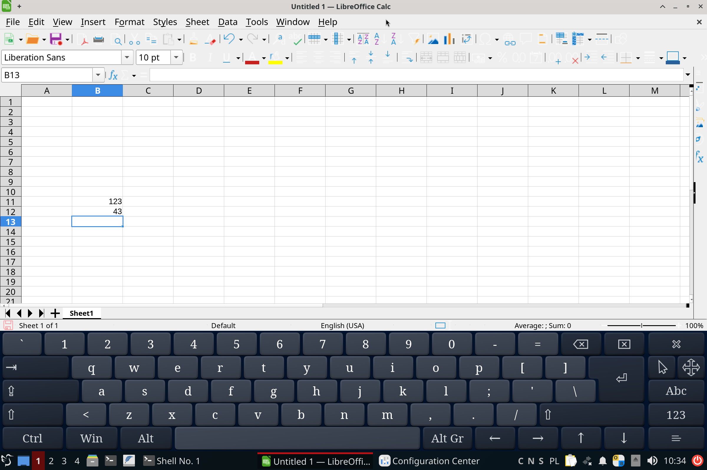

# Intro

In my use case there are two important things with regards to computing hardware:
1. I believe in separaton of use-case princple. I need very basic (but nice!) "typing machine" hardware for all personal-business things, like email, documents, spreadsheets. Demanding stuff, like gaming and software development I do on dedicated hardware.
2. I hate glossy screens, they cause headaches and a feeling of needles pinching the eyes

So you can imagine, No.2. rule is broken by 9x% of mobile devices on the market. The company with a fruit logo finally announced non-glossy screen... but it turned out to be an oxymoron, they charge $150 extra for a glossy screen with some diffuser in the inner layers of it.

Regarding No.1. rule, I've been on a lookout for my next "typing machine" as the years old 12" laptop screen started to be a strain on my eyesight.

I've recently got a hold of Nxtpaper 11" tablet from TCL. You know, it's a basic Androit tablet but with a quality matte screen finish. They built whatever silly marketing around it trying to lure e-ink reading device users to switch, etc. Nonetheless, it's a good device with an awesome screen, just ignore the "nxt paper" modes bs.

The TCL followed up on the success of the 11" model with new versions, including a 14". I was thinking about it, but honestly I don't need such large mobile device (think very limited mobile apps designed for tiny-screens, instead of desktop apps on a large screen). Nonetheless, I took the plunge buying quite cheaply the 14" version on Amazon. I didn't have much hope to make it the 100% of my "typing machine", but surprisingly it fits the purpose largerly exceeding my expectations!

PS. I've been looking at similar 13 or more devices with modern powerful ARM cpu for some time, though the major culprit preventing me from buying any of them was always the glossy screen and proprietary OS (non-Linux).

How come, you ask? That's my post-notes (hopefullly accurate) how I set it up. Just a few days ago I didn't even know about Termux-x11. Configuring it properly though took me a lot of effort, going through very outdated tutorials, discovering the gliches specific to recent Android version and this tablet. I've tried a few desktop environments, but LXQt does the job perfectly, being fast, low resoruces and working well with hidpi displays.

## 1. Base

Install [Termux app](https://github.com/termux/termux-app)

Install [Termux-x11 app](https://github.com/termux/termux-x11), nightly build

Start Termux app and execute:
```
pkg update
pkg install x11-repo
pkg install pulseaudio
pkg install proot-distro
```
also install a companion, nightly build, for the GUI app
```
pkg install termux-x11-nightly
```

Go to Android settings, enable 'Developer options' menu where you turn on 'Disable child process restrictions' to avoid random processes being killed, as explained on github, also 'Stay awake' to avoid suspending long operations when connected to power source.

## 2. Setup Debian LXQt

```
pkg proot-distro install debian
pkg proot-distro login debian
```

### Add user account

To be able to see the user home folder from Android File app, it has to be placed in special location instead of `/home/user`
```
mkdir /data/data/com.termux/files/home/user
```

Add user pointing to the desired home location
```
useradd -d /data/data/com.termux/files/home/user user
passwd user

apt update
apt install sudo

usermod -aG sudo user

su - user
chsh -s /bin/bash
exit

exit
```

At this point create helper script `bash.sh`

```
proot-distro login debian --user user
```

### Install LXQt desktop

```
./bash.sh
```

Install desktop
```
sudo apt install lxqt -y
```
Wait util it asks you for keyboard choice, then leave it running overnight (be patient it'll be stuck for hours in 'unpacking papirus-icon-theme')

Install libreoffice
```
sudo apt install libreoffice -y
sudo apt install libreoffice-qt6 -y
sudo apt install onboard -y

exit
```
The libreoffice QT plugin is needed for proper hidpi scalling.

Then create script for starting the desktop `destkop.sh`, [credits](https://github.com/LinuxDroidMaster/Termux-Desktops/blob/main/scripts/proot_debian/startlxde_debian.sh)
```
#!/data/data/com.termux/files/usr/bin/bash

# Kill open X11 processes
kill -9 $(pgrep -f "termux.x11") 2>/dev/null

# Enable PulseAudio over Network
pulseaudio --start --load="module-native-protocol-tcp auth-ip-acl=127.0.0.1 auth-anonymous=1" --exit-idle-time=-1

# Prepare termux-x11 session
export XDG_RUNTIME_DIR=${TMPDIR}
termux-x11 :0 >/dev/null &

# Wait a bit until termux-x11 gets started.
sleep 3

# Launch Termux X11 main activity
am start --user 0 -n com.termux.x11/com.termux.x11.MainActivity > /dev/null 2>&1
sleep 1

# Login in PRoot Environment. Do some initialization for PulseAudio, /tmp directory
# and run KDE as user.
# See also: https://github.com/termux/proot-distro
# Argument -- acts as terminator of proot-distro login options processing.
# All arguments behind it would not be treated as options of PRoot Distro.
proot-distro login debian --shared-tmp -- /bin/bash -c  'export PULSE_SERVER=127.0.0.1 && export XDG_RUNTIME_DIR=${TMPDIR} && su - user -c "env DISPLAY=:0 startlxqt"'

exit 0
```

### Fine-tune desktop

Te goal is to have a cristal crisp display using full screen resolution, but for the setup process you can set a 'scalled' 200% resolution in the Termux-x11 app options.

```
./desktop.sh
```

Open 'Preferences -> Session settings'
- set 'Scale factor: 2.00`
- uncheck 'Power Management' in LXQt Modules list (to avoid error popups during startup)
- add 'onboard' to autostart
- add env variable `SAL_USE_VCLPLUGIN=qt6`
- add env variable `SAL_VCL_QT6_USE_CAIRO=true`

The VCL env variable are needed to actually turn on the use of 'libreoffice-qt6' rendering plugin which adheres to the overall QT desktop scaling factor. I had no luck making the GTK rendering frontend accept a hidpi scalling.

Logout in the GUI. Open app preferences to change resolution to 'native' and start `./desktop.sh` again in Termux app shell.

In the GUI, start `onboard-settings` to cofigure the onscreen keyboard to your liking, for example 'Window -> Dock to screen edge'

## 3. TODOs

The above setup fullfills all my needs. Everything else will be just a cherry-on-the-top. 

There are some ways to pass-through harware acceleration. This account, which I foud earlier, have an interesting [article](https://github.com/LinuxDroidMaster/Termux-Desktops/blob/main/Documentation/HardwareAcceleration.md) to explore further.

I'm going to use web browser, ebook and pdf readers native apps, but who knows, if the termux setup proves to be energy efficient and fully accelerated I might just only use termux.

## 4. Miscelaous

The Alt+Tab from external keyboard is handled early, switching between Android apps instead of giving it to the Linux desktop.

Beware that when you switch back with Alt+Tab to the Termux-x11 desktop, the Alt key stays sticky. All touch and keyboard events are as if Alt+[event] was commanded, untill you tap Alt key again to release the sticky key behavior.

Surprisingly this tablet let me disable all Google apps, including Google play services. I had to install first some fossify apps from f-droid for the default apps to set them in Android settings -> Apps -> Default apps, instead of the Google apps before I could disable them. That's really what I like as I have no use of play store on my tablet but these apps will do something (useless) in background by default.

## 5. Screenshots

A LibreOffice Calc opened up with on-screen keyboard


Session-settings


Autostart onboard


Session env variables


